# Role Caster: 10 Impactful Base Chain Features Plan

## Executive Summary

This plan outlines 10 impactful features to enhance the Role Caster Mini App with advanced Base chain capabilities. These features will transform the app from a simple NFT minting tool into a comprehensive on-chain identity and community platform.

---

## Current Architecture Overview

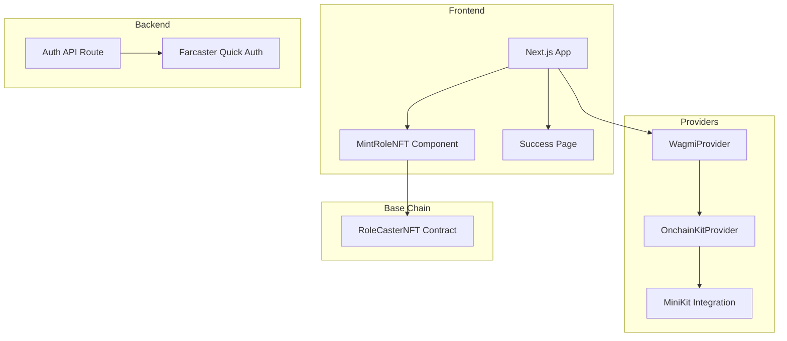

---

## Feature 1: NFT Gallery with Dynamic Metadata Display

### Description
Display users minted Role NFTs in a beautiful gallery view with full metadata support, including traits, rarity scores, and visual attributes.

### Technical Implementation

**New Files:**
- [`components/NFTGallery.tsx`](components/NFTGallery.tsx) - Gallery component
- [`components/NFTCard.tsx`](components/NFTCard.tsx) - Individual NFT card
- [`lib/nftMetadata.ts`](lib/nftMetadata.ts) - Metadata fetching utilities

**ABI Updates Required:**
```json
{
  "inputs": [{"internalType":"address","name":"owner","type":"address"}],
  "name": "tokensOfOwner",
  "outputs": [{"internalType":"uint256[]","name":"","type":"uint256[]"}],
  "stateMutability": "view",
  "type": "function"
},
{
  "inputs": [{"internalType":"uint256","name":"tokenId","type":"uint256"}],
  "name": "tokenURI",
  "outputs": [{"internalType":"string","name":"","type":"string"}],
  "stateMutability": "view",
  "type": "function"
}
```

**Key Dependencies:**
- wagmi `useReadContract` for fetching NFT data
- IPFS/Arweave for metadata storage

### Architecture
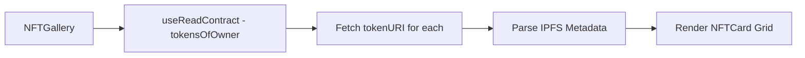

---

## Feature 2: Basenames Integration

### Description
Integrate Base Name Service to display and resolve .base names, allowing users to identify themselves with human-readable names instead of addresses.

### Technical Implementation

**New Files:**
- [`components/BasenameDisplay.tsx`](components/BasenameDisplay.tsx) - Display component
- [`lib/basenames.ts`](lib/basenames.ts) - Basename resolution utilities
- [`hooks/useBasename.ts`](hooks/useBasename.ts) - Custom hook for basename

**Integration with OnchainKit:**
```typescript
import { Name, Avatar } from '@coinbase/onchainkit/identity';

// OnchainKit provides built-in Basename support
<Name address={userAddress} chain={base} />
<Avatar address={userAddress} chain={base} />
```

**Features:**
- Display user's .base name if owned
- Show avatar associated with basename
- Link to basename registration if not owned

### Architecture
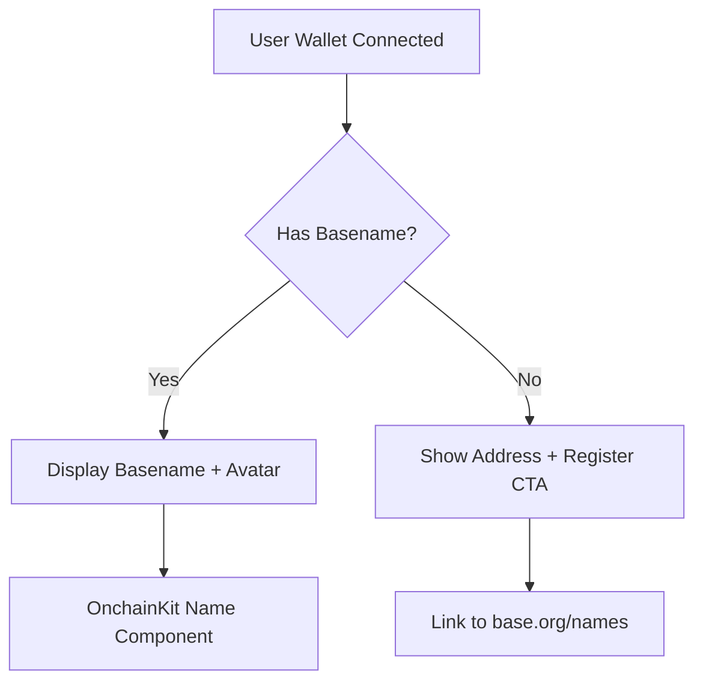

---

## Feature 3: On-chain Achievement Badges System

### Description
Implement an achievement/badge system that tracks user activities and mints soulbound achievement NFTs for completing milestones.

### Technical Implementation

**New Smart Contract:** `RoleCasterAchievements.sol`
- Soulbound tokens (non-transferable)
- Achievement categories: Minting, Social, Governance, Referral
- Admin functions for granting achievements

**New Files:**
- [`components/AchievementBadges.tsx`](components/AchievementBadges.tsx) - Badge display
- [`components/AchievementCard.tsx`](components/AchievementCard.tsx) - Individual badge
- [`lib/achievements.ts`](lib/achievements.ts) - Achievement definitions
- [`lib/RoleCasterAchievements.json`](lib/RoleCasterAchievements.json) - Contract ABI

**Achievement Types:**
| Badge | Criteria | Rarity |
|-------|----------|--------|
| Early Adopter | First 100 minters | Legendary |
| Role Master | Minted 5+ NFTs | Epic |
| Social Butterfly | Shared 10+ casts | Rare |
| Whale | Holds 1+ ETH on Base | Epic |
| Voter | Participated in governance | Rare |

### Architecture
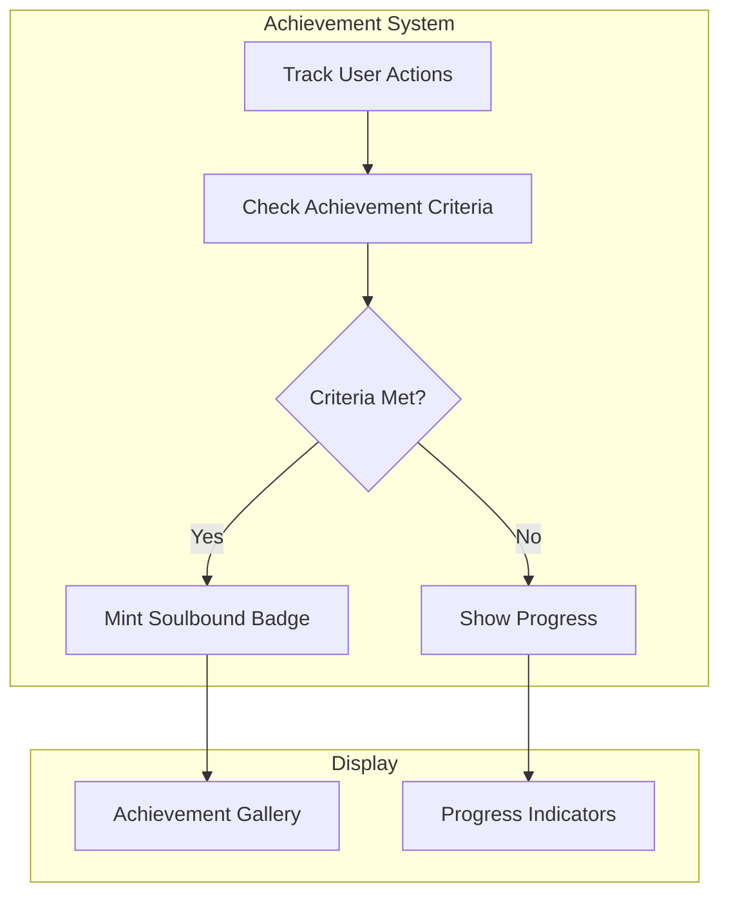

---

## Feature 4: Token-Gated Access Roles

### Description
Implement role-based access control where holding specific NFTs or tokens unlocks premium features and exclusive content.

### Technical Implementation

**New Files:**
- [`components/RoleGate.tsx`](components/RoleGate.tsx) - HOC for gating content
- [`hooks/useUserRoles.ts`](hooks/useUserRoles.ts) - Role detection hook
- [`lib/roleDefinitions.ts`](lib/roleDefinitions.ts) - Role configurations

**Role Hierarchy:**
```typescript
const ROLES = {
  VISITOR: { minNFTs: 0, features: ['view'] },
  MEMBER: { minNFTs: 1, features: ['view', 'vote', 'chat'] },
  VIP: { minNFTs: 3, features: ['view', 'vote', 'chat', 'earlyAccess'] },
  WHALE: { minETH: 1, features: ['view', 'vote', 'chat', 'earlyAccess', 'proposals'] },
};
```

**Implementation Pattern:**
```typescript
function useUserRoles(address: string) {
  const { data: nftBalance } = useReadContract({...});
  const { data: ethBalance } = useBalance({...});
  
  return calculateRoles(nftBalance, ethBalance);
}

// Usage
<RoleGate requiredRole="VIP">
  <ExclusiveContent />
</RoleGate>
```

### Architecture
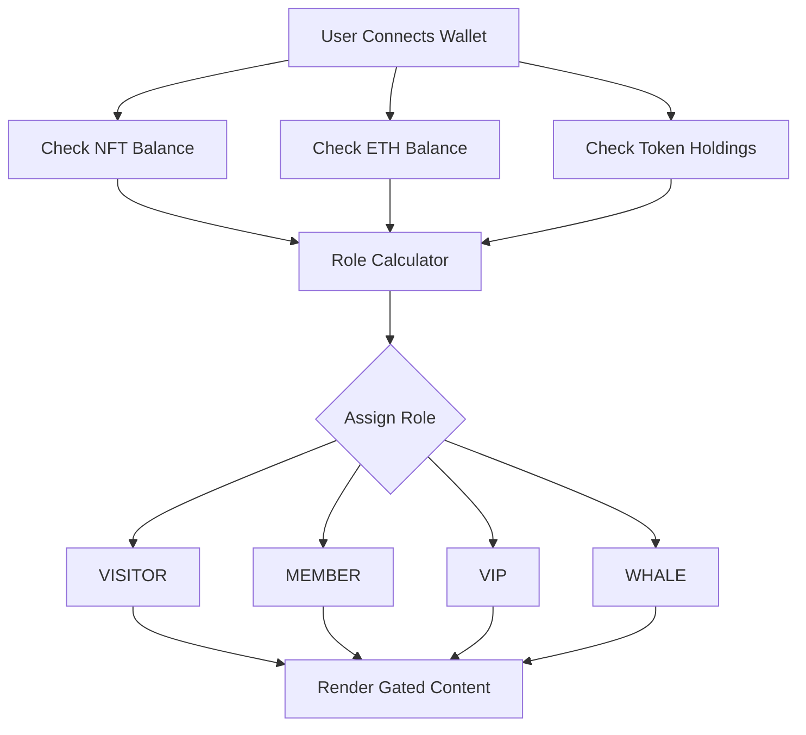

---

## Feature 5: Base Bridge Integration

### Description
Integrate bridge functionality to help users move assets from Ethereum mainnet to Base for seamless onboarding.

### Technical Implementation

**New Files:**
- [`components/BridgeWidget.tsx`](components/BridgeWidget.tsx) - Bridge UI component
- [`app/bridge/page.tsx`](app/bridge/page.tsx) - Dedicated bridge page
- [`lib/bridgeUtils.ts`](lib/bridgeUtils.ts) - Bridge helper functions

**Integration Options:**

1. **OnchainKit Fund Component:**
```typescript
import { FundButton } from '@coinbase/onchainkit/fund';

<FundButton />  // Built-in funding/bridging
```

2. **Base Bridge API Integration:**
```typescript
const BRIDGE_URL = 'https://bridge.base.org';
const SUPERBRIDGE_URL = 'https://superbridge.app/base';
```

**Features:**
- Display L1 vs L2 balances side by side
- One-click bridge with estimated fees
- Transaction tracking for bridge operations
- Support for ETH and major ERC-20 tokens

### Architecture
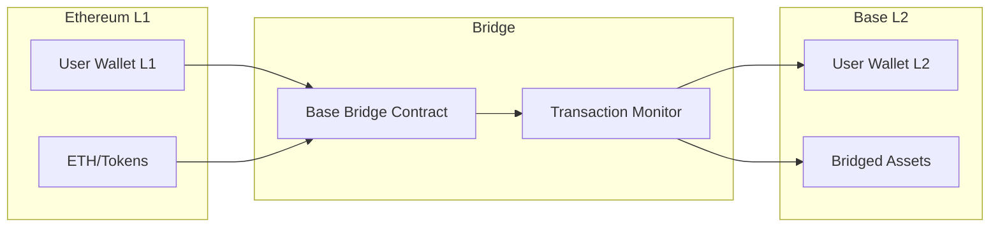

---

## Feature 6: Gasless Transactions with Paymaster

### Description
Implement gasless transactions using Coinbase Paymaster to sponsor gas fees, dramatically improving user experience especially for new users.

### Technical Implementation

**New Files:**
- [`lib/paymaster.ts`](lib/paymaster.ts) - Paymaster configuration
- [`hooks/useGaslessMint.ts`](hooks/useGaslessMint.ts) - Gasless transaction hook

**OnchainKit Paymaster Integration:**
```typescript
// In rootProvider.tsx
<OnchainKitProvider
  config={{
    paymaster: process.env.NEXT_PUBLIC_PAYMASTER_URL,
  }}
>
```

**Smart Wallet Integration:**
```typescript
import { 
  ConnectWallet,
  Wallet,
  WalletDropdown,
} from '@coinbase/onchainkit/wallet';

// Enable Smart Wallet for gasless txs
<Wallet>
  <ConnectWallet />
  <WalletDropdown />
</Wallet>
```

**Environment Variables:**
```bash
NEXT_PUBLIC_PAYMASTER_URL=https://api.developer.coinbase.com/rpc/v1/base/YOUR_API_KEY
```

**Sponsorship Rules:**
- First 3 mints per user are gasless
- Achievement badge mints are always gasless
- Voting transactions are gasless

### Architecture
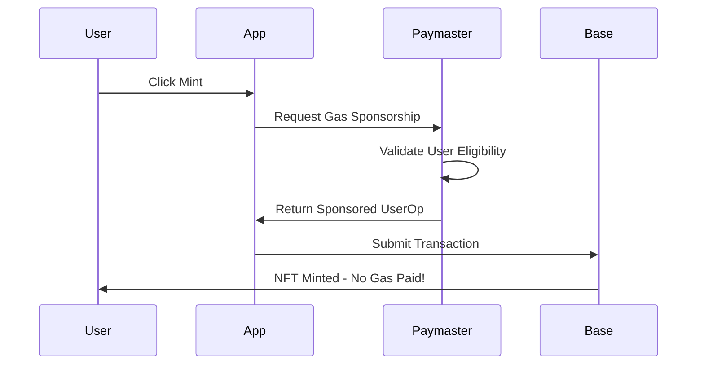

---

## Feature 7: On-chain Voting and Governance

### Description
Implement a governance system where NFT holders can create and vote on proposals, with votes weighted by NFT holdings.

### Technical Implementation

**New Smart Contract:** `RoleCasterGovernance.sol`
- Proposal creation with quorum requirements
- Time-locked voting periods
- Vote delegation support
- Execution of passed proposals

**New Files:**
- [`components/GovernanceHub.tsx`](components/GovernanceHub.tsx) - Main governance UI
- [`components/ProposalCard.tsx`](components/ProposalCard.tsx) - Proposal display
- [`components/CreateProposal.tsx`](components/CreateProposal.tsx) - Proposal creation
- [`components/VoteButton.tsx`](components/VoteButton.tsx) - Voting interface
- [`app/governance/page.tsx`](app/governance/page.tsx) - Governance page
- [`lib/RoleCasterGovernance.json`](lib/RoleCasterGovernance.json) - Contract ABI

**Governance Parameters:**
```typescript
const GOVERNANCE_CONFIG = {
  proposalThreshold: 1,      // Min NFTs to create proposal
  votingPeriod: 3 * 24 * 60 * 60,  // 3 days in seconds
  quorum: 10,                // Min votes for validity
  executionDelay: 24 * 60 * 60,    // 1 day timelock
};
```

**Vote Types:**
- For
- Against
- Abstain

### Architecture
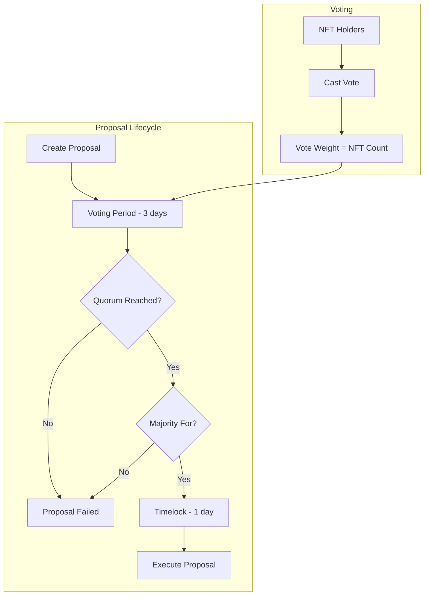

---

## Feature 8: Referral System with On-chain Rewards

### Description
Implement a referral program that tracks referrals on-chain and distributes rewards in ETH or tokens to successful referrers.

### Technical Implementation

**New Smart Contract:** `RoleCasterReferral.sol`
- Unique referral codes per user
- On-chain referral tracking
- Automatic reward distribution
- Anti-gaming mechanisms

**New Files:**
- [`components/ReferralDashboard.tsx`](components/ReferralDashboard.tsx) - Referral stats
- [`components/ReferralLink.tsx`](components/ReferralLink.tsx) - Shareable link generator
- [`components/ReferralRewards.tsx`](components/ReferralRewards.tsx) - Rewards display
- [`app/referral/page.tsx`](app/referral/page.tsx) - Referral page
- [`lib/RoleCasterReferral.json`](lib/RoleCasterReferral.json) - Contract ABI
- [`app/api/referral/route.ts`](app/api/referral/route.ts) - Referral tracking API

**Referral Flow:**
```typescript
// Generate referral link
const referralCode = keccak256(userAddress);
const referralLink = `${baseUrl}?ref=${referralCode}`;

// On mint with referral
function mintWithReferral(referrerCode) {
  // Validate referrer
  // Mint NFT
  // Credit referrer
  // Distribute rewards
}
```

**Reward Structure:**
| Tier | Referrals | Reward per Referral |
|------|-----------|---------------------|
| Bronze | 1-5 | 0.001 ETH |
| Silver | 6-20 | 0.002 ETH |
| Gold | 21-50 | 0.003 ETH |
| Platinum | 51+ | 0.005 ETH |

### Architecture
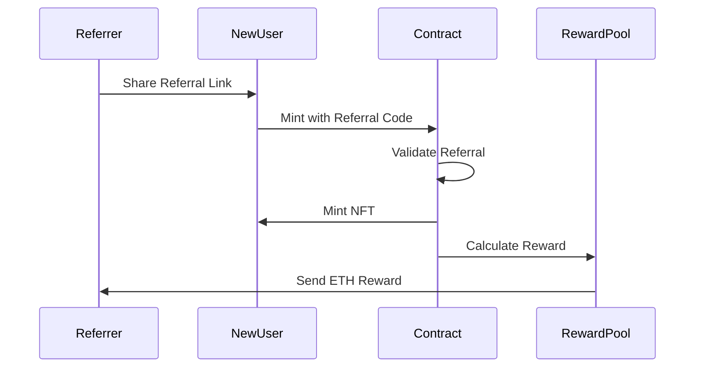

---

## Feature 9: Dynamic NFT Metadata System

### Description
Implement dynamic NFTs that evolve based on user activity, time held, or achievements unlocked. The metadata updates automatically reflecting the NFT's journey.

### Technical Implementation

**New Smart Contract:** `RoleCasterDynamicNFT.sol`
- On-chain metadata storage
- Evolution triggers
- Level/XP system

**New Files:**
- [`components/NFTEvolution.tsx`](components/NFTEvolution.tsx) - Evolution display
- [`components/NFTStats.tsx`](components/NFTStats.tsx) - Dynamic stats view
- [`lib/dynamicMetadata.ts`](lib/dynamicMetadata.ts) - Metadata calculation
- [`app/api/metadata/[tokenId]/route.ts`](app/api/metadata/[tokenId]/route.ts) - Dynamic metadata API

**Evolution Mechanics:**
```typescript
interface NFTMetadata {
  level: number;        // 1-100
  xp: number;           // Experience points
  evolution: string;    // 'Novice' | 'Apprentice' | 'Master' | 'Legend'
  traits: {
    power: number;
    wisdom: number;
    charisma: number;
  };
  achievements: string[];
  lastUpdated: number;
}
```

**XP Sources:**
| Action | XP Gained |
|--------|-----------|
| Daily login | 10 XP |
| Cast shared | 25 XP |
| Vote cast | 50 XP |
| Referral | 100 XP |
| Achievement unlocked | 200 XP |

**Evolution Thresholds:**
| Level | Evolution | Visual Change |
|-------|-----------|---------------|
| 1-10 | Novice | Basic appearance |
| 11-30 | Apprentice | Glow effect added |
| 31-60 | Master | Animated background |
| 61-100 | Legend | Full animation + particles |

### Architecture
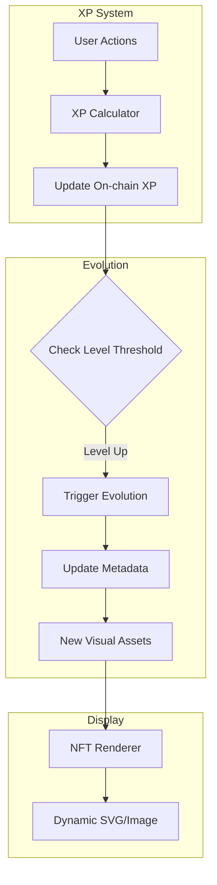

---

## Feature 10: Leaderboard with On-chain Points

### Description
Implement a competitive leaderboard system that tracks user activity and ranks them based on on-chain points, with weekly rewards for top performers.

### Technical Implementation

**New Smart Contract:** `RoleCasterLeaderboard.sol`
- Point accumulation tracking
- Weekly epoch system
- Reward distribution for top ranks
- Historical data storage

**New Files:**
- [`components/Leaderboard.tsx`](components/Leaderboard.tsx) - Main leaderboard UI
- [`components/LeaderboardRow.tsx`](components/LeaderboardRow.tsx) - Individual rank display
- [`components/UserRank.tsx`](components/UserRank.tsx) - Current user's position
- [`components/WeeklyRewards.tsx`](components/WeeklyRewards.tsx) - Reward pool display
- [`app/leaderboard/page.tsx`](app/leaderboard/page.tsx) - Leaderboard page
- [`lib/RoleCasterLeaderboard.json`](lib/RoleCasterLeaderboard.json) - Contract ABI
- [`hooks/useLeaderboard.ts`](hooks/useLeaderboard.ts) - Leaderboard data hook

**Point System:**
```typescript
const POINT_VALUES = {
  mint: 100,
  referral: 500,
  vote: 200,
  proposal: 1000,
  dailyLogin: 50,
  castShare: 150,
  achievementUnlock: 300,
};
```

**Weekly Rewards:**
| Rank | Reward |
|------|--------|
| 1st | 0.1 ETH |
| 2nd | 0.05 ETH |
| 3rd | 0.025 ETH |
| 4-10 | 0.01 ETH |
| 11-50 | Achievement Badge |

**Leaderboard Features:**
- Real-time rank updates
- Weekly/Monthly/All-time views
- Filter by category (minting, social, governance)
- User search functionality
- Animated rank changes

### Architecture
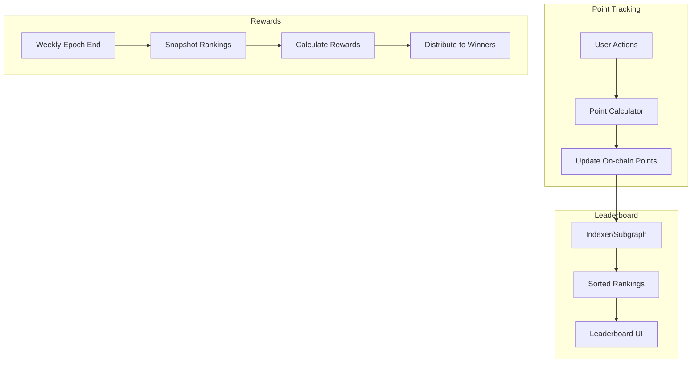

---

## Implementation Roadmap

### Phase 1: Foundation Features
1. NFT Gallery with Dynamic Metadata Display
2. Basenames Integration
3. Token-Gated Access Roles

### Phase 2: User Engagement
4. On-chain Achievement Badges System
5. Referral System with On-chain Rewards
6. Leaderboard with On-chain Points

### Phase 3: Advanced Features
7. Base Bridge Integration
8. Gasless Transactions with Paymaster
9. Dynamic NFT Metadata System
10. On-chain Voting and Governance

---

## New Project Structure

```
role-caster/
  app/
    page.tsx
    layout.tsx
    rootProvider.tsx
    globals.css
    api/
      auth/route.ts
      metadata/[tokenId]/route.ts    # NEW
      referral/route.ts              # NEW
    bridge/page.tsx                  # NEW
    governance/page.tsx              # NEW
    leaderboard/page.tsx             # NEW
    referral/page.tsx                # NEW
    success/page.tsx
  components/
    MintRoleNFT.tsx
    NFTGallery.tsx                   # NEW
    NFTCard.tsx                      # NEW
    BasenameDisplay.tsx              # NEW
    AchievementBadges.tsx            # NEW
    AchievementCard.tsx              # NEW
    RoleGate.tsx                     # NEW
    BridgeWidget.tsx                 # NEW
    GovernanceHub.tsx                # NEW
    ProposalCard.tsx                 # NEW
    CreateProposal.tsx               # NEW
    VoteButton.tsx                   # NEW
    ReferralDashboard.tsx            # NEW
    ReferralLink.tsx                 # NEW
    ReferralRewards.tsx              # NEW
    NFTEvolution.tsx                 # NEW
    NFTStats.tsx                     # NEW
    Leaderboard.tsx                  # NEW
    LeaderboardRow.tsx               # NEW
    UserRank.tsx                     # NEW
    WeeklyRewards.tsx                # NEW
  hooks/
    useBasename.ts                   # NEW
    useUserRoles.ts                  # NEW
    useGaslessMint.ts                # NEW
    useLeaderboard.ts                # NEW
  lib/
    wagmi.ts
    RoleCasterNFT.json
    RoleCasterAchievements.json      # NEW
    RoleCasterGovernance.json        # NEW
    RoleCasterReferral.json          # NEW
    RoleCasterLeaderboard.json       # NEW
    nftMetadata.ts                   # NEW
    basenames.ts                     # NEW
    achievements.ts                  # NEW
    roleDefinitions.ts               # NEW
    bridgeUtils.ts                   # NEW
    paymaster.ts                     # NEW
    dynamicMetadata.ts               # NEW
```

---

## Environment Variables Required

```bash
# Existing
NEXT_PUBLIC_PROJECT_NAME="Role Caster"
NEXT_PUBLIC_ONCHAINKIT_API_KEY=your_api_key
NEXT_PUBLIC_URL=https://your-domain.com
NEXT_PUBLIC_WC_PROJECT_ID=your_walletconnect_id
NEXT_PUBLIC_ROLE_CASTER_NFT_ADDRESS=0x...

# New - Contract Addresses
NEXT_PUBLIC_ACHIEVEMENTS_CONTRACT=0x...
NEXT_PUBLIC_GOVERNANCE_CONTRACT=0x...
NEXT_PUBLIC_REFERRAL_CONTRACT=0x...
NEXT_PUBLIC_LEADERBOARD_CONTRACT=0x...
NEXT_PUBLIC_DYNAMIC_NFT_CONTRACT=0x...

# New - Paymaster
NEXT_PUBLIC_PAYMASTER_URL=https://api.developer.coinbase.com/rpc/v1/base/YOUR_KEY

# New - Subgraph
NEXT_PUBLIC_SUBGRAPH_URL=https://api.thegraph.com/subgraphs/name/your-subgraph
```

---

## Smart Contracts Summary

| Contract | Purpose | Key Functions |
|----------|---------|---------------|
| RoleCasterNFT | Main NFT collection | mint, balanceOf, tokenURI |
| RoleCasterAchievements | Soulbound badges | grantAchievement, hasAchievement |
| RoleCasterGovernance | Voting system | propose, vote, execute |
| RoleCasterReferral | Referral tracking | registerReferral, claimRewards |
| RoleCasterLeaderboard | Points system | addPoints, getLeaderboard |
| RoleCasterDynamicNFT | Evolving NFTs | addXP, evolve, getMetadata |

---

## Dependencies to Add

```json
{
  "dependencies": {
    "@coinbase/onchainkit": "latest",
    "@farcaster/miniapp-sdk": "^0.1.8",
    "@tanstack/react-query": "^5.81.5",
    "next": "15.3.8",
    "react": "^19.0.0",
    "react-dom": "^19.0.0",
    "viem": "^2.31.6",
    "wagmi": "^2.16.3",
    "zustand": "^4.5.0",
    "framer-motion": "^11.0.0",
    "recharts": "^2.12.0"
  }
}
```

---

## Complete System Architecture

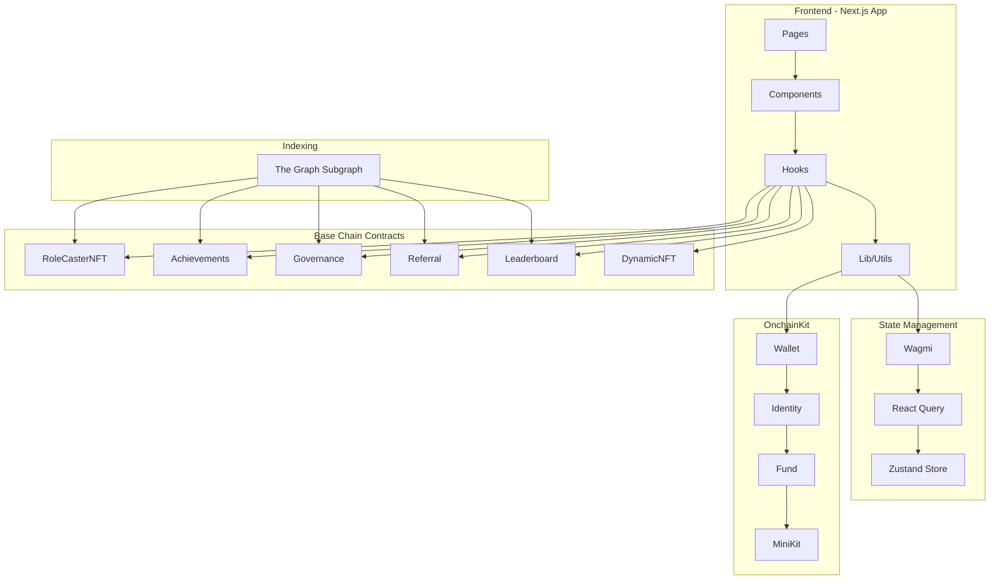

---

## Summary

These 10 features will transform Role Caster into a comprehensive Base chain platform:

1. **NFT Gallery** - Visual showcase of holdings
2. **Basenames** - Human-readable identity
3. **Achievements** - Gamified engagement
4. **Token-Gating** - Exclusive access control
5. **Bridge** - Seamless onboarding
6. **Paymaster** - Gasless experience
7. **Governance** - Community decision-making
8. **Referrals** - Viral growth mechanism
9. **Dynamic NFTs** - Evolving collectibles
10. **Leaderboard** - Competitive engagement

Each feature leverages Base chain's low fees, fast transactions, and the Coinbase/OnchainKit ecosystem to deliver an exceptional user experience.
